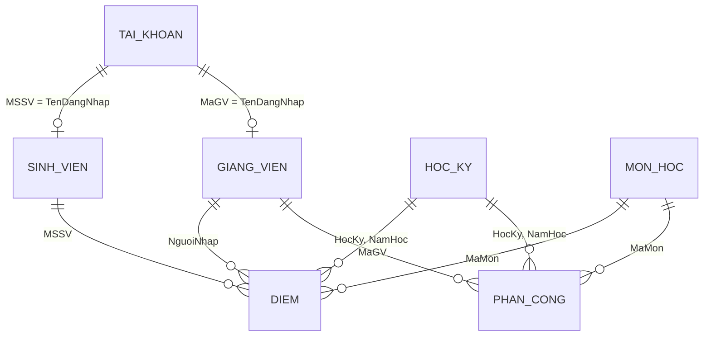

# Mô tả cơ sở dữ liệu — Quản lý điểm đại học

## Tổng quan

Hệ thống dùng **SQLite** (`database/quanlydiem.db`), khởi tạo từ `database/schema.sql`.

## Các bảng chính

| Bảng | Mô tả |
|------|--------|
| `HOC_KY` | Học kỳ / năm học, trạng thái, ngày bắt đầu–kết thúc |
| `TAI_KHOAN` | Đăng nhập, vai trò (Admin / Giảng viên / Sinh viên), khóa TK |
| `GIANG_VIEN` | Hồ sơ GV (FK → `TAI_KHOAN.TenDangNhap`) |
| `SINH_VIEN` | Hồ sơ SV, lớp, khoa, GPA10/GPA4, xếp loại |
| `KHOA` | Danh mục khoa |
| `MON_HOC` | Môn học, tín chỉ, hệ số CC/GK/CK |
| `DANH_MUC_LOP` | Danh mục mã lớp |
| `PHAN_CONG` | GV – môn – lớp – học kỳ |
| `DIEM` | Điểm CC, GK, CK, ĐTB, `DaKhoa` (đã công bố) |
| `DIEM_DANH` | Điểm danh theo buổi (tạo runtime) |
| `NHAT_KY_HE_THONG` | Nhật ký đăng nhập / điểm / quản trị |

## Quan hệ (ERD rút gọn)

## Quy tắc nghiệp vụ

- **ĐTB** = CC×HeSoCC + GK×HeSoGK + CK×HeSoCK (trigger khi đủ 3 thành phần).
- **GPA tích lũy** = trung bình có trọng số theo `SoTinChi`, chỉ tính điểm `DaKhoa = 1`.
- **Đậu môn**: ĐTB ≥ 4.0.

## Tài khoản mẫu

Sinh viên trong `SINH_VIEN` được bootstrap tạo tài khoản mật khẩu mặc định `12345678` (đã băm PBKDF2 sau lần chạy đầu).
